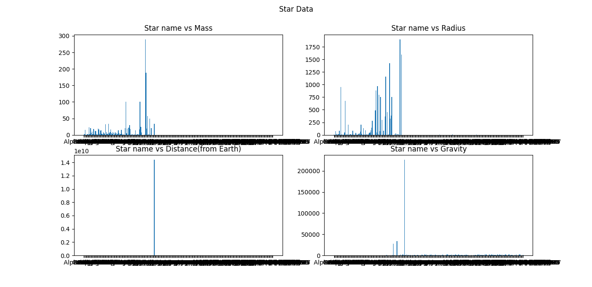

# Star Data Analysis using matplotlib

## Purpose

This code plots the variation of mass, radius, distance, and gravity among different stars using the gravity.csv dataset.

## Input

- The user must have gravity.csv dataset in the same directory as the code to run the code successfully.

## Output

- The code produces 4 plots on a 2x2 grid.
- The plots show the following:
- - Star name vs Mass
- - Star name vs Radius
- - Star name vs Distance (from Earth)
- - Star name vs Gravity

## Usage

1. To run the code, simply execute the script and it will display the plots with the respective title.

## Dependencies

- pandas
- matplotlib

## Author

Made By [Junaid](https://abujuni.dev) .
